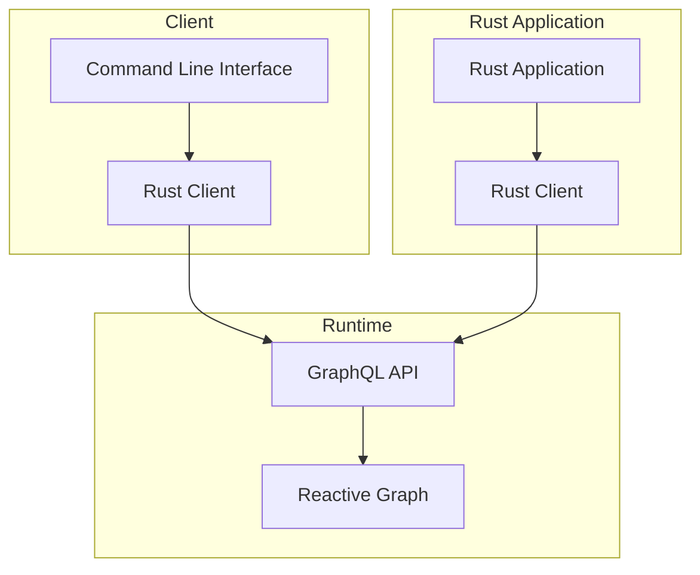
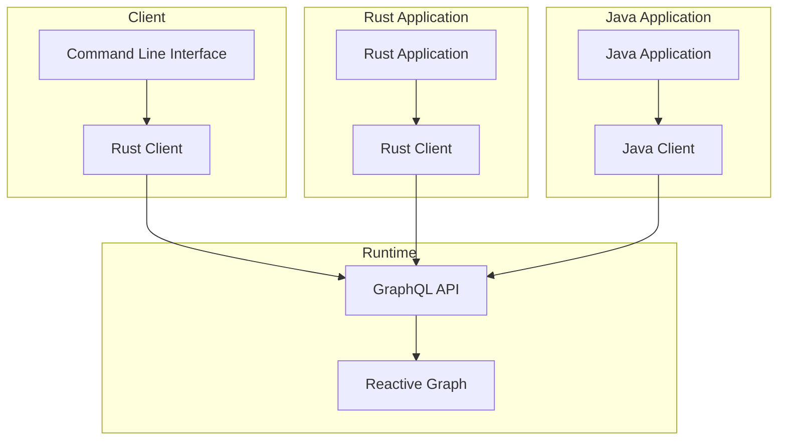




{{ header::print(year="2024",month="August") }}

<hr class="surface-2">

## Table of Contents

<!-- toc -->

<hr class="surface-2">

## Extended the <span class="token rg-component">Rust GraphQL Client</span>

The Rust GraphQL Client is important to make Reactive Graph more useful and accessible. It allows to access the Reactive Graph programmatically by simply
using the crate `reactive-graph-client`. The client crate is the foundation for the command line interface and for rust applications.

The Rust GraphQL Client is now capable to <span class="token rg-component">manage the type system</span>. This means you can query or alter components, entity
types and relation types. Furthermore, we started with the implementation of <span class="token rg-component">managing the instance system</span>. This means
you can query and alter entity instances and relation instances. Last but not least, we decided to defer work on the flow types and flow instances till instance
system has been fully implemented.

The following diagram shows the importance of the Rust GraphQL Client:



<hr class="celestial-blue">

## Extended the <span class="token rg-component">Command Line Interface</span>

The command line interface made big progress.

### Manage Type System via CLI

```shell
➜ reactive-graph client entity-types get string title_case                                                        
```

<details>
<summary>Command Output</summary>

```shell
╔════════════════════════╦════════════════════════╦══════════════════════════════════╦══════════════════════════════════════╦══════════════════════════════════════════════════════════════════════════════╦════════════════════════════════════════════════════════════════════════════════════════════════════════════════════╗
║ namespace              ║ name                   ║ description                      ║ components                           ║ properties                                                                   ║ extensions                                                                                                         ║
╠════════════════════════╬════════════════════════╬══════════════════════════════════╬══════════════════════════════════════╬══════════════════════════════════════════════════════════════════════════════╬════════════════════════════════════════════════════════════════════════════════════════════════════════════════════╣
║ string                 ║ title_case             ║ Converts the input to title case ║  namespace       │ name              ║  name                                │ data_type │ socket_type │ mutability  ║  namespace              │ name                   │ description │ extension                                         ║
║                        ║                        ║                                  ║ ─────────────────┼────────────────── ║ ─────────────────────────────────────┼───────────┼─────────────┼──────────── ║ ────────────────────────┼────────────────────────┼─────────────┼────────────────────────────────────────────────── ║
║                        ║                        ║                                  ║  string          │ string_operation  ║  result                              │ String    │ Output      │ Immutable   ║  core                   │ divergent              │             │ []                                                ║
║                        ║                        ║                                  ║                                      ║ ─────────────────────────────────────┼───────────┼─────────────┼──────────── ║ ────────────────────────┼────────────────────────┼─────────────┼────────────────────────────────────────────────── ║
║                        ║                        ║                                  ║                                      ║  lhs                                 │ String    │ Input       │ Mutable     ║  metadata               │ dublin-core            │             │ {                                                 ║
║                        ║                        ║                                  ║                                      ║                                                                              ║                         │                        │             │   "creator": "Hanack",                            ║
║                        ║                        ║                                  ║                                      ║                                                                              ║                         │                        │             │   "subject": "Converts the input to title case",  ║
║                        ║                        ║                                  ║                                      ║                                                                              ║                         │                        │             │   "title": "Title Case"                           ║
║                        ║                        ║                                  ║                                      ║                                                                              ║                         │                        │             │ }                                                 ║
╚════════════════════════╩════════════════════════╩══════════════════════════════════╩══════════════════════════════════════╩══════════════════════════════════════════════════════════════════════════════╩════════════════════════════════════════════════════════════════════════════════════════════════════════════════════╝
```

</details>

### Output Format Table

With the new parameter `--output-format` it is possible to output the data in table format (default), or as JSON or as TOML.

You can explicitly define the output format is table:

```shell
➜ reactive-graph client entity-instances list-properties 6ba7b810-9e15-11d1-50b4-00c04fd530c7 --output-format=table
```

Or you can just omit the option, because table is the default output format:

```shell
➜ reactive-graph client entity-instances list-properties 6ba7b810-9e15-11d1-50b4-00c04fd530c7
```

<details>
<summary>Command Output</summary>

```shell
╔════════════╦═════════════════════════════════════════════════════════════════════════════════════════════════════╗
║ name       ║ value                                                                                               ║
╠════════════╬═════════════════════════════════════════════════════════════════════════════════════════════════════╣
║ args       ║ [{"help":"Delay shutdown by N seconds","long":"delay","name":"delay","required":false,"short":"d"}] ║
╠════════════╬═════════════════════════════════════════════════════════════════════════════════════════════════════╣
║ cmd_result ║ 0                                                                                                   ║
╠════════════╬═════════════════════════════════════════════════════════════════════════════════════════════════════╣
║ prop_name  ║ "New Value"                                                                                         ║
╠════════════╬═════════════════════════════════════════════════════════════════════════════════════════════════════╣
║ label      ║ "/org/inexor/commands/core/shutdown"                                                                ║
╠════════════╬═════════════════════════════════════════════════════════════════════════════════════════════════════╣
║ delay      ║ 0                                                                                                   ║
╠════════════╬═════════════════════════════════════════════════════════════════════════════════════════════════════╣
║ command    ║ "shutdown"                                                                                          ║
╠════════════╬═════════════════════════════════════════════════════════════════════════════════════════════════════╣
║ trigger    ║ false                                                                                               ║
╠════════════╬═════════════════════════════════════════════════════════════════════════════════════════════════════╣
║ namespace  ║ "core"                                                                                              ║
╠════════════╬═════════════════════════════════════════════════════════════════════════════════════════════════════╣
║ help       ║ "Shutdown the application"                                                                          ║
╚════════════╩═════════════════════════════════════════════════════════════════════════════════════════════════════╝
```

</details>

### Output Format JSON

Additionally to the output format table, two new output formats have been implemented `json` and `toml`. This allows
to use the Reactive Graph CLI as tool for exporting types and instances.

```shell
➜ reactive-graph client entity-instances list-properties 6ba7b810-9e15-11d1-50b4-00c04fd530c7 --output-format=json
```

<details>
<summary>Command Output</summary>

```shell
[
  {
    "name": "help",
    "value": "Shutdown the application"
  },
  {
    "name": "label",
    "value": "/org/inexor/commands/core/shutdown"
  },
  {
    "name": "trigger",
    "value": false
  },
  {
    "name": "cmd_result",
    "value": 0
  },
  {
    "name": "prop_name",
    "value": "New Value"
  },
  {
    "name": "args",
    "value": [
      {
        "help": "Delay shutdown by N seconds",
        "long": "delay",
        "name": "delay",
        "required": false,
        "short": "d"
      }
    ]
  },
  {
    "name": "delay",
    "value": 0
  },
  {
    "name": "namespace",
    "value": "core"
  },
  {
    "name": "command",
    "value": "shutdown"
  }
]
```

</details>

Also, it allows to use the CLI as stdin for other CLI programs by using shell pipes. For example:

```shell
reactive-graph client entity-type get namespace type_name --output-format=JSON | less
```

<hr class="celestial-blue">

## Replacing OpenSSL with <span class="token rg-component">rustls</span>

* Started work on replacing OpenSSL with rustls
* Actix Web now supports rustls
* Patched the gql-client crate for rustls support
* Waiting for a PR in aws-lc-rs to be merged (https://github.com/aws/aws-lc-rs/pull/491) since aws-lc-rs requires NASM on windows and this breaks the CI

<hr class="celestial-blue">

## Continuous Modernization

* Fixed a bunch of <span class="token rg-component">clippy lints</span>
* Upgraded builds to use the <span class="token rg-component">latest nightly rust compiler</span>
* Replaced old GitHub Actions (actions-rs) with <span class="token rg-component">modern GitHub Actions</span>
* We are not quite happy that windows builds needs more than an hour and mac builds more than three hours, so we <span class="token rg-component">added another layer of cache</span> to speed up the CI
* <span class="token rg-component">Pinned the nightly version</span> in order to make caching in the CI more effective

<hr class="celestial-blue">

## <span class="token rg-component">Java</span> GraphQL Client

* The goal was to show that it's possible to manage the Reactive Graph <span class="token rg-component">from a programming language other than Rust</span>
* A gradle plugin <span class="token rg-component">generates</span> POJOs and interfaces from the GraphQL schema (<span class="token rg-component">schema first approach</span>). It's even possible to implement Spring Data alike repositories
* The status of the Java GraphQL Client is only a proof of concept. In the future, the Java GraphQL Client shall be on <span class="token rg-component">feature parity with the Rust GraphQL Client</span>

The following diagram shows how the GraphQL Client APIs are used by applications:



As you can see, thanks to the <span class="token rg-component">GraphQL API</span> it is possible to build applications
in different programming languages.

<hr class="celestial-blue">

## POC WASM / WASI

We implemented a [POC](https://github.com/reactive-graph/poc-wasm-wasi-preview-2-plugin-system) to check the current status of WASM. WASM will be an important
part of the Reactive Graph. One use case is that the Reactive Graph could use WASM to load plugins written in "any" language that compiles to WASM. Another use
case is that the Reactive Graph could use WASM to load behaviours for reactive entities or reactive relations. The POC showed that it now possible to interop
with more complex data than primitive data types like integers.

<hr class="celestial-blue">

## Identity and Permission System

Currently, Reactive Graph lacks an <span class="token rg-component">Identity and Permission System</span>. One of the next steps will be to implement it. We decided to not use an existing framework.
The type system has to be threatened a bit different from the instance system. Also, the permission system is more complex for the instance system. In a first
step we <span class="token rg-component">specified the requirements and the data model</span> of the upcoming identity management and the permission system
(https://github.com/reactive-graph/reactive-graph/issues/26).

<hr class="celestial-blue">

## Goals for September 2024

(highest priority on top)

1. Finish work on the rust GraphQL client and the Command Line Interface
2. Finish replacing OpenSSL with rustls
3. Start work on the Identity and Permission System
4. Specify the Type System Persistence (<span class="token rg-component">Graph Relational Mapper</span>)

{{ footer::print(issue_date_previous="", issue_date_next="2024-09-30") }}
