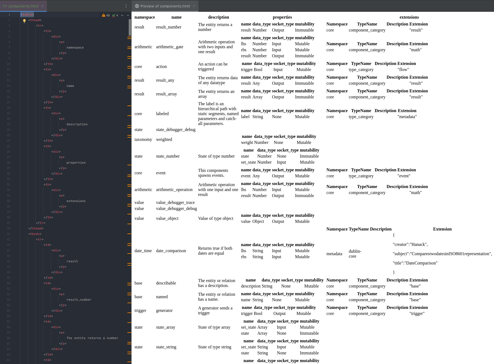
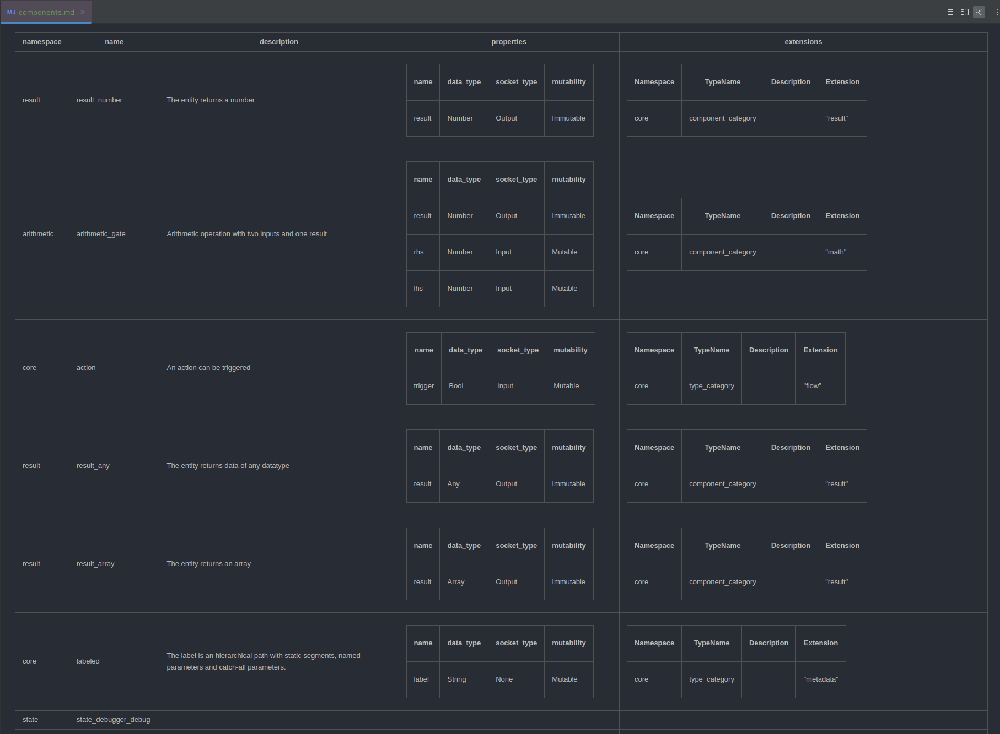




{{ header::print(year="2024",month="September") }}

<hr class="surface-2">

## Table of Contents

<!-- toc -->

<hr class="surface-2">

## Build

### Stable Rust

The biggest news this month is that we got managed to [compile](https://github.com/reactive-graph/reactive-graph/pull/148) Reactive Graph
with [Stable Rust](https://github.com/reactive-graph/reactive-graph/issues/102).

<details>
<summary>What has changed?</summary>

* Implemented `DashMap` as container for subscribers of `Stream` and removed usage of the unstable feature `unsized_tuple_coercion`
* Inlined implementation of feature `path_file_prefix` which will be stabilized soon, so that this is not a blocker
* Removed usage of the unstable feature `test` and migrated to criterion (see Benchmarking with Criterion)
* Removed usage of the unstable feature `register_tool` and make tarpaulin work again without this feature
* Detect if the compiler is nightly and only if so, make use of the unstable features `unboxed_closures` and `fn_traits`

</details>

<hr class="celestial-blue">

### Support for <span class="token rg-component">musl</span> builds

We [introduced](https://github.com/reactive-graph/reactive-graph/pull/155) support [MUSL](https://musl.libc.org/) builds.

<details>
<summary>What is musl?</summary>

<span class="token rg-component">musl</span> is an implementation of the C standard library built on top of the Linux system call API, including interfaces
defined in the base language standard, POSIX, and widely agreed-upon extensions. musl is lightweight, fast, simple, free, and strives to be correct in the
sense of standards-conformance and safety.

[https://musl.libc.org/](https://musl.libc.org/)

</details>

<details>
<summary>Setup and Compile using musl</summary>

In order to successfully compile, you also have to install the package `musl-tools`. For example for Debian / Ubuntu, you can install it like so:

```
$ apt install musl-tools
```

Next you have to add the musl target using `rustup`:

```
$ rustup target add x86_64-unknown-linux-musl
```

Finally you can compile reactive-graph for the target `x86_64-unknown-linux-musl`:

```
$ cargo build --target x86_64-unknown-linux-musl
```

</details>

<hr class="celestial-blue">

### rustls

We've [finished](https://github.com/reactive-graph/reactive-graph/pull/121) work on replacing
[OpenSSL with rustls](https://github.com/reactive-graph/reactive-graph/issues/107). OpenSSL is no more needed to build Reactive Graph.

<hr class="celestial-blue">

### Benchmarking with Criterion

Now the benchmark tests are run with [criterion](https://crates.io/crates/criterion) (which doesn't need Nightly Rust). Furthermore, the benchmarks has been
moved into its own `benches/` folders.

<details>
<summary>Features of Criterion</summary>

* Statistics: Statistical analysis detects if, and by how much, performance has changed since the last benchmark run
* Charts: Uses gnuplot to generate detailed graphs of benchmark results
* Stable-compatible: Benchmark your code without installing nightly Rust

</details>

A future task would be to write more benchmark tests and to execute benchmarking in the CI.

<hr class="celestial-blue">

## Continuous Integration

### Upgrade Workflows and Improve CI performance

We've [upgraded the workflow actions](https://github.com/reactive-graph/reactive-graph/pull/145) to recent versions. Furthermore, we made some changes
to <span class="token rg-component">speed up</span> the CI. We've merge workflow files and made build jobs and test jobs dependent on the formatting check job
and linting jobs. With this change, no build time is wasted if linting and formatting doesn't meet the requirements. Furthermore, we're run linting and test
suite on Linux GNU and Linux <span class="token rg-component">musl</span> for Rust <span class="token rg-component">stable</span> and
Rust <span class="token rg-component">nightly</span>. But we don't run the complete test suite on Windows and macOS anymore. This is because running the test
suite on Windows is 2x slower and on macOS is 6x slower compared to running on Linux. At a later point we may reintroduce a smaller subset of the test suite to
run on Windows and macOS.

<hr class="celestial-blue">

### New Checks

* Minimal Supported Rust Version (MSRV)
* Dependabot now checks for outdated dependencies
* Checks that the CHANGELOG was edited

<hr class="celestial-blue">

## Command Line Interface

### Managing the Instance System

We finished the implementation of managing the instance system via CLI ([entity instances](https://github.com/reactive-graph/reactive-graph/pull/134) and
[relation instances](https://github.com/reactive-graph/reactive-graph/pull/135)). Furthermore, the CLI lists the applied components of the reactive instances.

### Documented Command Line Interface

The [book](https://docs.reactive-graph.io/book/) now contains a section about the
[Command Line Interface](https://docs.reactive-graph.io/book/CLI_Usage.html). We've added a section about the
[interactive mode](https://docs.reactive-graph.io/book/CLI_REPL.html) and a section about the
[command reference](https://docs.reactive-graph.io/book/CLI_Reference.html). For the command reference we make use of a new option to automatically generate
the help in Markdown format:

<details>
<summary><code>$ reactive-graph --markdown-help</code></summary>

TODO: Insert output here

</details>

### Output Format Count

We've [added a new output format](https://github.com/reactive-graph/reactive-graph/pull/135) that simply prints the count instead of a table with the results.
The purpose of the new feature is similar to `count(*)` in SQL and is also useful for shell automation.

```
$ reactive-graph client components list --output-format count
$ reactive-graph client entity-types list --output-format count
$ reactive-graph client relation-types list --output-format count
$ reactive-graph client entity-instances list --output-format count
$ reactive-graph client relation-instances list --output-format count
```

<details>
<summary>Examples</summary>

**Print the count of components**

```
$ reactive-graph client components list --output-format count
34 result(s)
```

**Example: Print the count of entity-instances**

```
$ reactive-graph client entity-instances list --output-format count
1554 result(s)
```

**Example: Print the count of entity-instances that having the component `core__action`**

```
$ reactive-graph client entity-instances list --components core__action --output-format count
2 result(s)
```

</details>

### Output Format HTML

We have added a new option to output the result as HTML table. This applies to all type system and instance system operations.



#### List types and instances as HTML table

```
$ reactive-graph client components list --output-format html-table
$ reactive-graph client entity-types list --output-format html-table
$ reactive-graph client relation-types list --output-format html-table
$ reactive-graph client entity-instances list --output-format html-table
$ reactive-graph client relation-instances list --output-format html-table
```

#### List all components as HTML table

<details>
<summary><code>$ reactive-graph client components list --output-format html-table</code></summary>

<pre><code>
<table>
    <thead>
    <tr>
        <th>namespace</th>
        <th>name</th>
        <th>description</th>
        <th>properties</th>
        <th>extensions</th>
    </tr>
    </thead>
    <tbody>
    <tr>
        <td>state</td>
        <td>state_object</td>
        <td>State of type object</td>
        <td>
            <table>
                <thead>
                <tr>
                    <th>name</th>
                    <th>data_type</th>
                    <th>socket_type</th>
                    <th>mutability</th>
                </tr>
                </thead>
                <tbody>
                <tr>
                    <td>state</td>
                    <td>Object</td>
                    <td>None</td>
                    <td>Immutable</td>
                </tr>
                <tr>
                    <td>set_state</td>
                    <td>Object</td>
                    <td>Input</td>
                    <td>Mutable</td>
                </tr>
                </tbody>
            </table>
        </td>
        <td>
        </td>
    </tr>
    <tr>
        <td>value</td>
        <td>value_debugger_trace</td>
        <td></td>
        <td></td>
        <td></td>
    </tr>
    <tr>
        <td>arithmetic</td>
        <td>arithmetic_operation</td>
        <td>Arithmetic operation with one input and one result</td>
        <td>
            <table>
                <thead>
                <tr>
                    <th>name</th>
                    <th>data_type</th>
                    <th>socket_type</th>
                    <th>mutability</th>
                </tr>
                </thead>
                <tbody>
                <tr>
                    <td>result</td>
                    <td>Number</td>
                    <td>Output</td>
                    <td>Immutable</td>
                </tr>
                <tr>
                    <td>lhs</td>
                    <td>Number</td>
                    <td>Input</td>
                    <td>Mutable</td>
                </tr>
                </tbody>
            </table>
        </td>
        <td>
            <table>
                <thead>
                <tr>
                    <th>Namespace</th>
                    <th>TypeName</th>
                    <th>Description</th>
                    <th>Extension</th>
                </tr>
                </thead>
                <tbody>
                <tr>
                    <td>core</td>
                    <td>component_category</td>
                    <td></td>
                    <td>"math"</td>
                </tr>
                </tbody>
            </table>
        </td>
    </tr>
    <tr>
        <td>base</td>
        <td>named</td>
        <td>The entity or relation has a name.</td>
        <td>
            <table>
                <thead>
                <tr>
                    <th>name</th>
                    <th>data_type</th>
                    <th>socket_type</th>
                    <th>mutability</th>
                </tr>
                </thead>
                <tbody>
                <tr>
                    <td>name</td>
                    <td>String</td>
                    <td>None</td>
                    <td>Mutable</td>
                </tr>
                </tbody>
            </table>
        </td>
        <td>
            <table>
                <thead>
                <tr>
                    <th>Namespace</th>
                    <th>TypeName</th>
                    <th>Description</th>
                    <th>Extension</th>
                </tr>
                </thead>
                <tbody>
                <tr>
                    <td>core</td>
                    <td>component_category</td>
                    <td></td>
                    <td>"base"</td>
                </tr>
                </tbody>
            </table>
        </td>
    </tr>
    <tr>
        <td>value</td>
        <td>value_object</td>
        <td>Value of type object</td>
        <td>
            <table>
                <thead>
                <tr>
                    <th>name</th>
                    <th>data_type</th>
                    <th>socket_type</th>
                    <th>mutability</th>
                </tr>
                </thead>
                <tbody>
                <tr>
                    <td>value</td>
                    <td>Object</td>
                    <td>Output</td>
                    <td>Mutable</td>
                </tr>
                </tbody>
            </table>
        </td>
        <td>
        </td>
    </tr>
    <tr>
        <td>result</td>
        <td>result_boolean</td>
        <td>The entity returns a boolean</td>
        <td>
            <table>
                <thead>
                <tr>
                    <th>name</th>
                    <th>data_type</th>
                    <th>socket_type</th>
                    <th>mutability</th>
                </tr>
                </thead>
                <tbody>
                <tr>
                    <td>result</td>
                    <td>Bool</td>
                    <td>Output</td>
                    <td>Immutable</td>
                </tr>
                </tbody>
            </table>
        </td>
        <td>
            <table>
                <thead>
                <tr>
                    <th>Namespace</th>
                    <th>TypeName</th>
                    <th>Description</th>
                    <th>Extension</th>
                </tr>
                </thead>
                <tbody>
                <tr>
                    <td>core</td>
                    <td>component_category</td>
                    <td></td>
                    <td>"result"</td>
                </tr>
                </tbody>
            </table>
        </td>
    </tr>
    </tbody>
</table>
</code></pre>

</details>

#### Output a single type or a single instance as HTML table

```
$ reactive-graph client components get <namespace> <type_name> --output-format html-table
$ reactive-graph client entity-types get <namespace> <type_name> --output-format html-table
$ reactive-graph client relation-types get <namespace> <type_name> --output-format html-table
$ reactive-graph client entity-instances get <namespace> <type_name> --output-format html-table
$ reactive-graph client relation-instances get <namespace> <type_name> --output-format html-table
```

#### Output a single component as HTML table

<details>
<summary><code>$ reactive-graph client components get value value_number --output-format html-table</code></summary>

<table>
    <thead>
        <tr>
            <th>namespace</th>
            <th>name</th>
            <th>description</th>
            <th>properties</th>
            <th>extensions</th>
        </tr>
    </thead>
    <tbody>
        <tr>
            <td>value</td>
            <td>value_number</td>
            <td>Value of type number</td>
            <td>
                <table><thead><tr><th>name</th><th>data_type</th><th>socket_type</th><th>mutability</th></tr></thead><tbody><tr><td>value</td><td>Number</td><td>Output</td><td>Mutable</td></tr></tbody></table>
            </td>
            <td>
            </td>
        </tr>
    </tbody>
</table>

</details>

### Output Format Markdown

Similar to the Output Format HTML, the Output Format Markdown prints the result as Markdown Table.



#### List types and instances as Markdown table

```
$ reactive-graph client components list --output-format markdown-table
$ reactive-graph client entity-types list --output-format markdown-table
$ reactive-graph client relation-types list --output-format markdown-table
$ reactive-graph client entity-instances list --output-format markdown-table
$ reactive-graph client relation-instances list --output-format markdown-table
```

#### List all components as Markdown table

<details>
<summary><code>$ reactive-graph client components list --output-format markdown-table</code></summary>

| namespace  | name                 | description                                                                                             | properties                                                                                                                                                                                                                                                                                                                                                                                                                                                                                                                                                                                                                                                                                                                                                                                                                                                                                                                                   | extensions                                                                                                                                                                                                                                                                                                                                                                                                                                                                   |
|------------|----------------------|---------------------------------------------------------------------------------------------------------|----------------------------------------------------------------------------------------------------------------------------------------------------------------------------------------------------------------------------------------------------------------------------------------------------------------------------------------------------------------------------------------------------------------------------------------------------------------------------------------------------------------------------------------------------------------------------------------------------------------------------------------------------------------------------------------------------------------------------------------------------------------------------------------------------------------------------------------------------------------------------------------------------------------------------------------------|------------------------------------------------------------------------------------------------------------------------------------------------------------------------------------------------------------------------------------------------------------------------------------------------------------------------------------------------------------------------------------------------------------------------------------------------------------------------------|
| state      | state_object         | State of type object                                                                                    | <table><thead><tr><th><div><p>name</p></div></th><th><div><p>data_type</p></div></th><th><div><p>socket_type</p></div></th><th><div><p>mutability</p></div></th></tr></thead><tbody><tr><td><div><p>set_state</p></div></td><td><div><p>Object</p></div></td><td><div><p>Input</p></div></td><td><div><p>Mutable</p></div></td></tr><tr><td><div><p>state</p></div></td><td><div><p>Object</p></div></td><td><div><p>None</p></div></td><td><div><p>Immutable</p></div></td></tr></tbody></table>                                                                                                                                                                                                                                                                                                                                                                                                                                            |                                                                                                                                                                                                                                                                                                                                                                                                                                                                              |
| value      | value_debugger_trace |                                                                                                         |                                                                                                                                                                                                                                                                                                                                                                                                                                                                                                                                                                                                                                                                                                                                                                                                                                                                                                                                              |                                                                                                                                                                                                                                                                                                                                                                                                                                                                              |
| arithmetic | arithmetic_operation | Arithmetic operation with one input and one result                                                      | <table><thead><tr><th><div><p>name</p></div></th><th><div><p>data_type</p></div></th><th><div><p>socket_type</p></div></th><th><div><p>mutability</p></div></th></tr></thead><tbody><tr><td><div><p>result</p></div></td><td><div><p>Number</p></div></td><td><div><p>Output</p></div></td><td><div><p>Immutable</p></div></td></tr><tr><td><div><p>lhs</p></div></td><td><div><p>Number</p></div></td><td><div><p>Input</p></div></td><td><div><p>Mutable</p></div></td></tr></tbody></table>                                                                                                                                                                                                                                                                                                                                                                                                                                               | <table><thead><tr><th><div><p>Namespace</p></div></th><th><div><p>TypeName</p></div></th><th><div><p>Description</p></div></th><th><div><p>Extension</p></div></th></tr></thead><tbody><tr><td><div><p>core</p></div></td><td><div><p>component_category</p></div></td><td><div><p></p></div></td><td><div><p>"math"</p></div></td></tr></tbody></table>                                                                                                                     |
| base       | named                | The entity or relation has a name.                                                                      | <table><thead><tr><th><div><p>name</p></div></th><th><div><p>data_type</p></div></th><th><div><p>socket_type</p></div></th><th><div><p>mutability</p></div></th></tr></thead><tbody><tr><td><div><p>name</p></div></td><td><div><p>String</p></div></td><td><div><p>None</p></div></td><td><div><p>Mutable</p></div></td></tr></tbody></table>                                                                                                                                                                                                                                                                                                                                                                                                                                                                                                                                                                                               | <table><thead><tr><th><div><p>Namespace</p></div></th><th><div><p>TypeName</p></div></th><th><div><p>Description</p></div></th><th><div><p>Extension</p></div></th></tr></thead><tbody><tr><td><div><p>core</p></div></td><td><div><p>component_category</p></div></td><td><div><p></p></div></td><td><div><p>"base"</p></div></td></tr></tbody></table>                                                                                                                     |
| value      | value_object         | Value of type object                                                                                    | <table><thead><tr><th><div><p>name</p></div></th><th><div><p>data_type</p></div></th><th><div><p>socket_type</p></div></th><th><div><p>mutability</p></div></th></tr></thead><tbody><tr><td><div><p>value</p></div></td><td><div><p>Object</p></div></td><td><div><p>Output</p></div></td><td><div><p>Mutable</p></div></td></tr></tbody></table>                                                                                                                                                                                                                                                                                                                                                                                                                                                                                                                                                                                            |                                                                                                                                                                                                                                                                                                                                                                                                                                                                              |
| result     | result_boolean       | The entity returns a boolean                                                                            | <table><thead><tr><th><div><p>name</p></div></th><th><div><p>data_type</p></div></th><th><div><p>socket_type</p></div></th><th><div><p>mutability</p></div></th></tr></thead><tbody><tr><td><div><p>result</p></div></td><td><div><p>Bool</p></div></td><td><div><p>Output</p></div></td><td><div><p>Immutable</p></div></td></tr></tbody></table>                                                                                                                                                                                                                                                                                                                                                                                                                                                                                                                                                                                           | <table><thead><tr><th><div><p>Namespace</p></div></th><th><div><p>TypeName</p></div></th><th><div><p>Description</p></div></th><th><div><p>Extension</p></div></th></tr></thead><tbody><tr><td><div><p>core</p></div></td><td><div><p>component_category</p></div></td><td><div><p></p></div></td><td><div><p>"result"</p></div></td></tr></tbody></table>                                                                                                                   |

</details>

#### Output a single type or a single instance as Markdown table

```
$ reactive-graph client components get <namespace> <type_name> --output-format markdown-table
$ reactive-graph client entity-types get <namespace> <type_name> --output-format markdown-table
$ reactive-graph client relation-types get <namespace> <type_name> --output-format markdown-table
$ reactive-graph client entity-instances get <namespace> <type_name> --output-format markdown-table
$ reactive-graph client relation-instances get <namespace> <type_name> --output-format markdown-table
```

#### Output a single component as Markdown table

<details>
<summary><code>$ reactive-graph client components get value value_number --output-format markdown-table</code></summary>

| namespace | name         | description          | properties                                                                                                                                                                                                                                                                                                                                        | extensions |
|-----------|--------------|----------------------|---------------------------------------------------------------------------------------------------------------------------------------------------------------------------------------------------------------------------------------------------------------------------------------------------------------------------------------------------|------------|
| value     | value_number | Value of type number | <table><thead><tr><th><div><p>name</p></div></th><th><div><p>data_type</p></div></th><th><div><p>socket_type</p></div></th><th><div><p>mutability</p></div></th></tr></thead><tbody><tr><td><div><p>value</p></div></td><td><div><p>Number</p></div></td><td><div><p>Output</p></div></td><td><div><p>Mutable</p></div></td></tr></tbody></table> |            |

</details>

<hr class="celestial-blue">

### Shell Completions

In order to further improve the user experience with the command line interface we've implemented the feature to generate shell completions.

<details>
<summary>List of Supported Shells</summary>

* bash
* elvish
* fish
* powershell
* zsh

</details>

On linux it's possible to install the shell completions for the given shell by executing:

```    
$ reactive-graph --install-shell-completions bash|fish|zsh
```

Then you have to restart the shell, for example:

```
$ zsh
```

Profit!

<details>
<summary><code>$ reactive-graph --</code> <kbd>TAB</kbd></summary>

```
--daemon-group               -- If set will drop privileges to the specified group. Note: Both must be given: user and group
--daemon                     -- If true, the process will run as daemon
--daemon-name                -- Sets the name of the daemon
--daemon-pid                 -- The location of the daemon PID file. By default, no PID file will be created
--daemon-stderr              -- Stderr will be written into this file
--daemon-stdout              -- Stdout will be written into this file
--daemon-user                -- If set will drop privileges to the specified user. Note: Both must be given: user and group
--daemon-working-directory   -- The working directory of the daemon
--default-context-path       -- The default context path which redirects the root context to a web resource provider
--disable-all-plugins        -- If true, all plugins will be disabled
--disabled-plugins           -- The list of plugins to disable
--disable-hot-deploy         -- If true, hot deployment will be disabled
--enabled-plugins            -- The list of plugins to enable
--graphql-config             -- The GraphQL config location
--help                       -- Print help
--hostname                   -- The hostname to bind the GraphQL HTTP server
--hot-deploy-location        -- The folder which is watched for hot deployment
--install-location           -- The folder which plugins are installed permanently
--install-man-pages          -- If true, installs man pages
--install-shell-completions  -- If true, installs shell completions
--instance-config            -- The instance config location
--instance-description       -- The description of the instance
--instance-name              -- The name of the instance
--logging-config             -- The logging config location
--markdown-help              -- If true, generates command line documentation
--plugins-config             -- The plugins config location
--port                       -- The port to bind the GraphQL HTTP server
--print-man-pages            -- If true, generates man pages
--print-shell-completions    -- If true, prints shell completions
--quiet                      -- If true, logging is disabled completely
--secure                     -- If true, HTTPS is enabled
--shutdown-timeout           -- Timeout for graceful workers shutdown in seconds. After receiving a stop signal, workers have this much time to finish serving requests. Workers still alive after the timeout are force dropped. By default, shutdown timeout sets to 30 seconds
--ssl-certificate-path       -- The location of the certificate
--ssl-private-key-path       -- The location of the private key
--stop-immediately           -- If true, the runtime does not wait before exiting
--version                    -- Print version
--workers                    -- The number of workers to start. The default worker count is the number of physical CPU cores available
```

</details>

<hr class="celestial-blue">

### Man Pages (Linux only)

Similarly to shell completions, the command line interface can generate, print and install man pages.

<details>
<summary>What is a man page?</summary>

A man page (short for manual page) is a form of software documentation usually found on a Unix or Unix-like operating system. Topics covered include computer
programs (including library and system calls), formal standards and conventions, and even abstract concepts. A user may invoke a man page by issuing the man
command.

[Wikipedia](https://en.wikipedia.org/wiki/Man_page)

</details>

First, you can install man pages:

```
$ reactive-graph --install-man-pages
```

Then you can use the `man` command:

<details>
<summary><code>$ man reactive-graph</code></summary>

```
reactive-graph(1)                                                                                                                                          General Commands Manual                                                                                                                                          reactive-graph(1)

NAME
       reactive-graph - Reactive Graph is a reactive runtime based on a graph database, empowering everyone to build reliable and efficient software.

SYNOPSIS
       reactive-graph  [--logging-config] [--instance-config] [--graphql-config] [--plugins-config] [-n|--instance-name] [-d|--instance-description] [--hostname] [--port] [--secure] [--ssl-certificate-path] [--ssl-private-key-path] [--shutdown-timeout] [-w|--workers] [-c|--default-context-path] [-x|--disable-all-plugins] [-p|--dis‐
       abled-plugins] [-P|--enabled-plugins] [--disable-hot-deploy] [--hot-deploy-location] [--install-location] [--stop-immediately] [-q|--quiet] [--print-man-pages] [--install-man-pages] [--print-shell-completions] [--install-shell-completions]  [-D|--daemon]  [--daemon-name]  [--daemon-pid]  [--daemon-working-directory]  [--dae‐
       mon-stdout] [--daemon-stderr] [--daemon-user] [--daemon-group] [-h|--help] [-V|--version] [subcommands]

DESCRIPTION
       Reactive Graph is a reactive runtime based on a graph database, empowering everyone to build reliable and efficient software.

OPTIONS
       --logging-config=LOGGING_CONFIG
              The logging config location
              May also be specified with the REACTIVE_GRAPH_LOGGING_CONFIG environment variable.

       --instance-config=INSTANCE_CONFIG
              The instance config location
              May also be specified with the REACTIVE_GRAPH_INSTANCE_CONFIG environment variable.

...
```

</details>

<hr class="celestial-blue">

### Dedicated client binary

We follow the approach to have one binary for all use cases (server & client).

Additionally, we
[now provide a second binary that only contains the client](https://github.com/reactive-graph/reactive-graph/pull/135).

<details>
<summary><code>$ ls -lah target/debug/reactive-graph*</code></summary>

```
-rwxrwxr-x 2 rust rust 81M reactive-graph
-rwxrwxr-x 2 rust rust 29M reactive-graph-client
```

</details>

<details>
<summary><code>$ reactive-graph-client relation-instances list --output-format count</code></summary>

```
9366 result(s)
```

</details>

<hr class="celestial-blue">

### Daemonize

On Linux, it's [now possible to start the process and run it in the background](https://github.com/reactive-graph/reactive-graph/pull/153). Because the daemon
has no stdout and stderr, a file can be given as output. Also, the process can drop privileges to a given user+group. Optionally, a PID and name can be
specified.

<details>
<summary><code>$ reactive-graph --help</code></summary>

```
  -D, --daemon
          If true, the process will run as daemon [env: REACTIVE_GRAPH_DAEMON=]
      --daemon-name <DAEMON_NAME>
          Sets the name of the daemon [env: REACTIVE_GRAPH_DAEMON_NAME=]
      --daemon-pid <DAEMON_PID>
          The location of the daemon PID file. By default, no PID file will be created [env: REACTIVE_GRAPH_DAEMON_PID=]
      --daemon-working-directory <DAEMON_WORKING_DIRECTORY>
          The working directory of the daemon [env: REACTIVE_GRAPH_DAEMON_WORKING_DIRECTORY=]
      --daemon-stdout <DAEMON_STDOUT>
          Stdout will be written into this file [env: REACTIVE_GRAPH_DAEMON_STDOUT=]
      --daemon-stderr <DAEMON_STDERR>
          Stderr will be written into this file [env: REACTIVE_GRAPH_DAEMON_STDERR=]
      --daemon-user <DAEMON_USER>
          If set will drop privileges to the specified user. Note: Both must be given: user and group [env: REACTIVE_GRAPH_DAEMON_USER=]
      --daemon-group <DAEMON_GROUP>
          If set will drop privileges to the specified group. Note: Both must be given: user and group [env: REACTIVE_GRAPH_DAEMON_GROUP=]
```


</details>

In order to start Reactive Graph as a daemon, you have to pass the parameter `-D` or set the environment variable `REACTIVE_GRAPH_DAEMON=true`:

```
$ reactive-graph --daemon
```

<hr class="celestial-blue">

## Refactoring

### Extracted table model

The table model has been [refactored into its own crate](https://github.com/reactive-graph/reactive-graph/pull/135). This allows to print tables in other
command line applications.

The examples are now using the table model. The printed tables look better than before. Thanks to the table model, it is no more necessary to render tables
manually.

<hr class="celestial-blue">

### GraphQL Schema

There are some changes to the GraphQL schema:

<details>
<summary>List of Changes</summary>

* edgeKey has been renamed to relationInstanceId for consistency
* EdgeKeyDefinition has been renamed to RelationInstanceIdDefinition for consistency
* Extended mutation `instances -> relations -> update()` with the new parameters addProperties and removeProperties in order to add or remove one or multiple properties

</details>

<hr class="celestial-blue">

## Design System Enhancements

### Circle Logos

We added a [new set of logos](https://design.reactive-graph.io/docs/fundamentals/logo.html) with a circle around the inner graph symbol:

<table>
    <tr>
        <td>Black/White</td>
        <td>Malachite</td>
        <td>Selective Yellow</td>
        <td>Celestial Blue</td>
        <td>Mexican Pink</td>
        <td>Chartreuse</td>
    </tr>
    <tr>
        <td></td>
        <td></td>
        <td></td>
        <td></td>
        <td></td>
        <td></td>
    </tr>
    <tr>
        <td></td>
        <td></td>
        <td></td>
        <td></td>
        <td></td>
        <td></td>
    </tr>
    <tr>
        <td></td>
        <td></td>
        <td></td>
        <td></td>
        <td></td>
        <td></td>
    </tr>
</table>

<hr class="celestial-blue">

### Horizontal Rules

Nothing special, but useful: [horizontal rules](https://design.reactive-graph.io/components/detail/hr--default.html)

<hr class="celestial-blue">

## Project Maintenance

### Social Media

We created a [YouTube channel](https://www.youtube.com/@reactive-graph), a [facebook profile](https://www.facebook.com/reactive.graph) and a
[mastodon account](https://floss.social/@reactive_graph). We will start social media activities in near future.

<hr class="celestial-blue">

### Contribution Guidelines & Security Policy

We've extended the [Contribution Guidelines](https://github.com/reactive-graph/reactive-graph/blob/main/CONTRIBUTING.md) and added a
[Security Policy](https://github.com/reactive-graph/reactive-graph/blob/main/SECURITY.md).

<hr class="celestial-blue">

{{ footer::print(issue_date_previous="2024-08", issue_date_next="2024-10") }}
