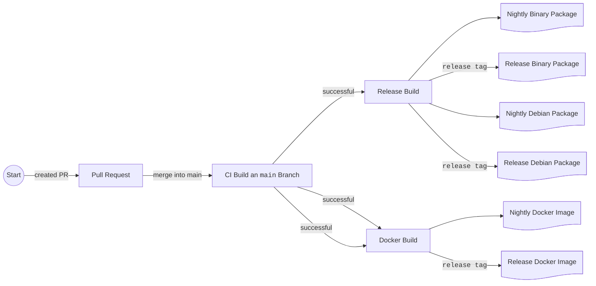




{{ header::print(year="2024",month="October") }}

<hr class="surface-2">

## Table of Contents

<!-- toc -->

<hr class="surface-2">

October 2024 was a very productive month for Reactive Graph. We focused on Continuous Integration and [Delivery](https://github.com/reactive-graph/reactive-graph/issues/228). The results are impressive:

## Self Info

The Reactive Graph binary can now output information about itself. This includes the version number, the rust compiler version, the rust compiler channel,
the target triple, and the git commit hash.

<details>
<summary><code>$ reactive-graph info</code></summary>

```
+---------+--------------------------+---------+------------------------------------------+---------------+---------------+
| version | target_triple            | git_tag | git_commit                               | rustc_channel | rustc_version |
+---------+--------------------------+---------+------------------------------------------+---------------+---------------+
| 0.10.0  | x86_64-unknown-linux-gnu |         | 7d8b37cf5549a12a4da5feff5184778d25110e62 | stable        | 1.82.0        |
+---------+--------------------------+---------+------------------------------------------+---------------+---------------+
```

</details>

<details>
<summary><code>$ reactive-graph info --output-format=json</code></summary>

```json
[
  {
    "version": "0.10.0",
    "target_triple": "x86_64-unknown-linux-gnu",
    "git_tag": "",
    "git_commit": "7d8b37cf5549a12a4da5feff5184778d25110e62",
    "rustc_channel": "stable",
    "rustc_version": "1.82.0"
  }
]
```

</details>

## Self Updater

What is probably most interesting for end users is that Reactive Graph now has the ability
[to update itself](https://github.com/reactive-graph/reactive-graph/pull/212). Thanks to the Rust [self_update library](https://crates.io/crates/self_update),
implementation was relatively easy.

A new command has been implemented with which you can process the update:

<details>
<summary><code>$ reactive-graph update --help</code></summary>

```
Update the Reactive Graph binary

Usage: reactive-graph update [OPTIONS] [COMMAND]

Commands:
  info  Shows information about the selected release
  list  Lists the releases
  help  Print this message or the help of the given subcommand(s)

Options:
  -n, --nightly                 Updates to the nightly release
  -l, --latest                  Updates to the latest release. Currently, the latest release is the nightly release. This will change in the future
  -c, --current                 Updates to the current release
  -v, --version <VERSION>       Updates to a specific version
      --hide-download-progress  Hides the download progress
      --hide-output             Hides the output
  -q, --quiet                   Hides the download progress and the output
  -y, --no-confirm              Don't ask
  -h, --help                    Print help
```

</details>

You can use the subcommand info to find out which version would be updated to.

<details>
<summary><code>$ reactive-graph update info</code></summary>

```
+---------------+---------+------------+------------------------------------------+------------------------------------------+
| Release Name  | Version | Date       | Asset Name                               | Download URL                             |
+---------------+---------+------------+------------------------------------------+------------------------------------------+
| Nightly Build | nightly | 2024-10-29 | reactive-graph-nightly-x86_64-unknown-li | https://api.github.com/repos/reactive-gr |
|               |         |            | nux-gnu.tar.gz                           | aph/reactive-graph/releases/assets/20270 |
|               |         |            |                                          | 9875                                     |
+---------------+---------+------------+------------------------------------------+------------------------------------------+
```

</details>

As you can see, the `nightly` version would be installed. It also shows the name of the asset to be downloaded and from which URL the download would occur.

If you finally want to carry out the update, you can do this with the command:

<details>
<summary><code>$ reactive-graph update</code></summary>

```
Checking target-arch... x86_64-unknown-linux-gnu
Checking current version... v0.10.0
Looking for tag: nightly

reactive-graph release status:
  * Current exe: "/home/user/.cargo/bin/reactive-graph"
  * New exe release: "reactive-graph-nightly-x86_64-unknown-linux-gnu.tar.gz"
  * New exe download url: "https://api.github.com/repos/reactive-graph/reactive-graph/releases/assets/202709875"

The new release will be downloaded/extracted and the existing binary will be replaced.
Do you want to continue? [Y/n] Y
Downloading...
[00:00:02] [====================>-------------------] 19.41 MiB/37.41 MiB (3s)  
Extracting archive... Done
Replacing binary file... Done
Successfully updated to version: nightly
```

</details>

You can use the `--no-confirm` option to ensure that the update is carried out without query.

### Specify the version to update to

| Option                     | Description                                                                                                           |
|----------------------------|-----------------------------------------------------------------------------------------------------------------------|
| `--latest`                 | Updates to the latest release. Currently, the latest release is the nightly release. This will change in the future.  |
| `--nightly`                | Updates to the nightly release                                                                                        |
| `--version 0.10.0-alpha-2` | Updates to a specific version                                                                                         |

### List of releases

You can find out which releases are available from the shell. These version numbers can be used with the `--version` option to install a specific version of Reactive Graph.

<details>
<summary><code>$ reactive-graph update list</code></summary>

```
+-----------------+----------------+------------+------------------------------------------+------------------------------------------+
| Release Name    | Version        | Date       | Asset Name                               | Download URL                             |
+-----------------+----------------+------------+------------------------------------------+------------------------------------------+
| Nightly Build   | nightly        | 2024-10-29 | reactive-graph-nightly-x86_64-unknown-li | https://api.github.com/repos/reactive-gr |
|                 |                |            | nux-gnu.tar.gz                           | aph/reactive-graph/releases/assets/20270 |
|                 |                |            |                                          | 9875                                     |
+-----------------+----------------+------------+------------------------------------------+------------------------------------------+
| v0.10.0-alpha-2 | 0.10.0-alpha-2 | 2024-10-27 | reactive-graph-v0.10.0-alpha-2-x86_64-un | https://api.github.com/repos/reactive-gr |
|                 |                |            | known-linux-gnu.tar.gz                   | aph/reactive-graph/releases/assets/20211 |
|                 |                |            |                                          | 3533                                     |
+-----------------+----------------+------------+------------------------------------------+------------------------------------------+
| v0.10.0-alpha-1 | 0.10.0-alpha-1 | 2024-10-20 | reactive-graph-v0.10.0-alpha-1-x86_64-un | https://api.github.com/repos/reactive-gr |
|                 |                |            | known-linux-gnu.tar.gz                   | aph/reactive-graph/releases/assets/20031 |
|                 |                |            |                                          | 6307                                     |
+-----------------+----------------+------------+------------------------------------------+------------------------------------------+
| v0.9.1-25       | 0.9.1-25       | 2023-07-20 | inexor-rgf-rt-standalone-x86_64-unknown- | https://api.github.com/repos/reactive-gr |
|                 |                |            | linux-gnu.tar.gz                         | aph/reactive-graph/releases/assets/11789 |
|                 |                |            |                                          | 6809                                     |
+-----------------+----------------+------------+------------------------------------------+------------------------------------------+
| v0.9.1-22       | 0.9.1-22       | 2023-05-12 | inexor-rgf-rt-standalone-x86_64-unknown- | https://api.github.com/repos/reactive-gr |
|                 |                |            | linux-gnu.tar.gz                         | aph/reactive-graph/releases/assets/10790 |
|                 |                |            |                                          | 4471                                     |
+-----------------+----------------+------------+------------------------------------------+------------------------------------------+
|                 | 0.9.1-3        | 2023-05-07 | Not available                            |                                          |
+-----------------+----------------+------------+------------------------------------------+------------------------------------------+
| v0.9.1          | 0.9.1          | 2023-05-01 | inexor-rgf-rt-standalone-x86_64-unknown- | https://api.github.com/repos/reactive-gr |
|                 |                |            | linux-gnu.tar.gz                         | aph/reactive-graph/releases/assets/10621 |
|                 |                |            |                                          | 6527                                     |
+-----------------+----------------+------------+------------------------------------------+------------------------------------------+
| v0.9.0-15       | 0.9.0-15       | 2023-05-01 | inexor-rgf-rt-standalone-x86_64-unknown- | https://api.github.com/repos/reactive-gr |
|                 |                |            | linux-gnu.tar.gz                         | aph/reactive-graph/releases/assets/10621 |
|                 |                |            |                                          | 3683                                     |
+-----------------+----------------+------------+------------------------------------------+------------------------------------------+
| v0.2.1-alpha    | 0.2.1-alpha    | 2021-08-29 | Not available                            |                                          |
+-----------------+----------------+------------+------------------------------------------+------------------------------------------+
```

</details>


<hr class="celestial-blue">

## Improved Release Process and Distribution Channels

In order for the self-updater to be useful, the release and distribution process needed to be improved. With the improved release process, different types of 
[releases](https://github.com/reactive-graph/reactive-graph/releases) are now produced and
[distributed via a number of channels](https://github.com/reactive-graph/reactive-graph/issues/228):

| Channel          | Description                                                                                                                                                | Status  |
|------------------|------------------------------------------------------------------------------------------------------------------------------------------------------------|---------|
| Source           | The source code is available for download for each release.                                                                                                | Done    |
| Binary Packages  | Binary packages are produced for each release. The binary distributions can be downloaded manually. See below for expanded support of supported platforms. | Done    |
| Self Updater     | The self-updater is based on the binary distributions.                                                                                                     | Done    |
| Debian Packages  | Debian packages are produced for each release. The Debian packages can be downloaded manually.                                                             | Done    |
| Docker           | Docker images are produced for each release. The Docker images are uploaded to ghcr.io and can be obtained from there.                                     | Done    |
| Website Download | In the future, every release should be available for download via the website.                                                                             | Planned |
| crates.io        | In the future, every regular release should be published on crates.io.                                                                                     | Planned |
| APT              | In the future, each release's Debian packages should be available via an APT repository.                                                                   | Planned |

In the following graphic you can see the process of a release.

A submitted pull request can only be merged if a number of prerequisites are met:

1. The code compiles under Rust Stable and Rust Nightly.
2. The code compiles on Linux, Windows and MacOSx.
3. Code Formatting is equivalent to automatic formatting.
4. The minimum Rust compiler version has not increased.
5. There are no warnings from the linter.

After the merge, the checks are also repeated on the `main` branch and if successful, release builds and Docker builds are triggered.



<hr class="celestial-blue">

## Nightly Builds

What's new is that the release process produces [nightly builds](https://github.com/reactive-graph/reactive-graph/releases/tag/nightly). This happens with every
merge to the `main` branch. The existing `nightly` release is updated, the [Git tag nightly](https://github.com/reactive-graph/reactive-graph/pull/202) is moved
to the latest commit and finally new binary packages, new Debian packages and new Docker images are produced.

We won't produce regular releases often in the near future because we can't guarantee compatibility yet. Instead, the constantly updated nightly releases are
available.

<div class="alert alert--warning">
    <h3>
        <i class="ti ti-alert-triangle"></i>
        Warning!
    </h3>
    <p>At this point, the software is not yet feature-complete and essential features are still missing, such as the flow editor, the persistence of the type system and instance system, and an authorization layer.</p>
</div>

<hr class="celestial-blue">

## Platform Support

Rust is a compiled language. If the software should be able to run on different systems, we should ensure this during development. Reactive Graph has various
application areas that go beyond the classic desktop system. For example, Reactive-Graph for smart home applications should run on a Raspberry Pi. This has
an ARM processor.

Fortunately, Rust supports cross-compiling for other CPU and OS platforms. This month we added
[some new CPU architectures]((https://github.com/reactive-graph/reactive-graph/pull/205)) to continuous integration and are producing binary packages and Debian
packages for all of these platforms.

This is the updated list of supported platforms:

| target                         | New | Description                                       | Tier |
|--------------------------------|-----|---------------------------------------------------|------|
| x86_64-unknown-linux-gnu       |     | 64-bit Linux (kernel 3.2+, glibc 2.17+)           | 1    |
| x86_64-pc-windows-msvc         |     | 64-bit MSVC (Windows 10+, Windows Server 2016+)   | 1    |
| aarch64-apple-darwin           |     | ARM64 macOS (11.0+, Big Sur+)                     | 1    |
| x86_64-apple-darwin            |     | 64-bit macOS (10.12+, Sierra+)                    | 1    |
| universal-apple-darwin         |     |                                                   |      |
| aarch64-unknown-linux-gnu      |     | ARM64 Linux (kernel 4.1, glibc 2.17+)             | 1    |
| aarch64-unknown-linux-musl     | Yes | ARM64 Linux with musl 1.2.3                       | 2    |
| armv7-unknown-linux-gnueabihf  | Yes | Armv7-A Linux, hardfloat (kernel 3.2, glibc 2.17) | 2    |
| armv7-unknown-linux-musleabihf | Yes | Armv7-A Linux, hardfloat (kernel 3.2, glibc 2.17) | 2    |
| i686-unknown-linux-gnu         | Yes | 32-bit Linux (kernel 3.2+, glibc 2.17+)           | 1    |
| powerpc-unknown-linux-gnu      | Yes | PowerPC Linux (kernel 3.2, glibc 2.17)            | 2    |
| powerpc64-unknown-linux-gnu    | Yes | PPC64 Linux (kernel 3.2, glibc 2.17)              | 2    |
| powerpc64le-unknown-linux-gnu  | Yes | PPC64LE Linux (kernel 3.10, glibc 2.17)           | 2    |
| riscv64gc-unknown-linux-gnu    | Yes | RISC-V Linux (kernel 4.20, glibc 2.29)            | 2    |
| x86_64-pc-windows-gnu          | Yes | 64-bit MinGW (Windows 10+, Windows Server 2016+)  | 1    |
| x86_64-unknown-linux-musl      | Yes | 64-bit Linux with musl 1.2.3                      | 2    |

<hr class="celestial-blue">

## Docker

Furthermore, the first Docker images are now available for both regular releases and as nightly builds. The Docker images are available via
[GitHub Packages](https://github.com/reactive-graph/reactive-graph/pkgs/container/reactive-graph) (i.e. via ghcr.io).

### Run

<details>
<summary><code>$ docker run -d -p 31415:31415 --name reactive-graph ghcr.io/reactive-graph/reactive-graph:latest</code></summary>

```
85b3a6868f4bc91e336fb1033d349b70c48b207f0122b5284f77002bae2894c4
```

</details>

<details>
<summary><code>$ docker ps</code></summary>

```
CONTAINER ID   IMAGE                                          COMMAND              CREATED              STATUS              PORTS                                           NAMES                                                                                                                                                   │
85b3a6868f4b   ghcr.io/reactive-graph/reactive-graph:latest   "./reactive-graph"   13 seconds ago       Up 12 seconds       0.0.0.0:31415->31415/tcp, :::31415->31415/tcp   reactive-graph
```

</details>

<details>
<summary><code>$ docker stop 85b3a6868f4b</code></summary>

```
85b3a6868f4b
```

</details>

### Multiple Instances

It is possible to run multiple instances of Reactive Graph in parallel. All you have to do is bind another port on the host system.

<details>
<summary><code>$ docker run -d -p 31416:31415 --name reactive-graph-2 ghcr.io/reactive-graph/reactive-graph:latest</code></summary>

```
7f689869a76df29179478d74872c6d6b4c9d144415bd3fc9d16225ecf8ae8f62
```

</details>

<details>
<summary><code>$ docker ps</code></summary>

```
CONTAINER ID   IMAGE                                          COMMAND              CREATED              STATUS              PORTS                                           NAMES
85b3a6868f4b   ghcr.io/reactive-graph/reactive-graph:latest   "./reactive-graph"   13 seconds ago       Up 12 seconds       0.0.0.0:31415->31415/tcp, :::31415->31415/tcp   reactive-graph
7f689869a76d   ghcr.io/reactive-graph/reactive-graph:latest   "./reactive-graph"   53 seconds ago       Up 52 seconds       0.0.0.0:31417->31415/tcp, :::31417->31415/tcp   reactive-graph-2
```

</details>

### Dockerfile

```dockerfile
FROM alpine as reactive-graph
RUN apk add zsh nano curl
WORKDIR /opt/reactive-graph
COPY --from=builder --chown=reactive-graph:reactive-graph /app/target/release/reactive-graph .
RUN addgroup --gid 1000 reactive-graph
RUN adduser -h /opt/reactive-graph -s /bin/bash -G reactive-graph -u 1000 -D reactive-graph
USER reactive-graph
RUN ./reactive-graph instances init --uid 1000 --gid 1000
RUN ./reactive-graph instances config graphql --hostname "0.0.0.0" --secure true
RUN ./reactive-graph instances config instance --instance-name "Reactive Graph" --instance-description "Docker"
ENV PATH="$PATH:/opt/reactive-graph"
EXPOSE 31415
```

<hr class="celestial-blue">

## Debian Packages

More platforms are now supported. Debian packages are also provided for regular releases and as nightly builds.
The [new folder structure](https://github.com/reactive-graph/reactive-graph/pull/204/files) is now taken into account.

| Debian Package                            | Debian Target | Rust Target                   |
|-------------------------------------------|---------------|-------------------------------|
| reactive-graph_0.10.0-nightly_amd64.deb   | amd64         | x86_64-unknown-linux-gnu      |
| reactive-graph_0.10.0-nightly_arm64.deb   | arm64         | aarch64-unknown-linux-gnu     |
| reactive-graph_0.10.0-nightly_armhf.deb   | armhf         | armv7-unknown-linux-gnueabihf |
| reactive-graph_0.10.0-nightly_i386.deb    | i386          | i686-unknown-linux-gnu        |
| reactive-graph_0.10.0-nightly_powerpc.deb | powerpc       | powerpc-unknown-linux-gnu     |
| reactive-graph_0.10.0-nightly_ppc64.deb   | ppc64         | powerpc-unknown-linux-gnu     |
| reactive-graph_0.10.0-nightly_ppc64el.deb | ppc64el       | powerpc64le-unknown-linux-gnu |
| reactive-graph_0.10.0-nightly_riscv64.deb | riscv64       | riscv64gc-unknown-linux-gnu   |

<hr class="celestial-blue">

## CLI Instance Management

### Instance Initialization

The Dockerfile benefits from another new feature: The Reactive Graph Binary can now
[initialize a folder structure for new instances](https://github.com/reactive-graph/reactive-graph/issues/187).

<details>
<summary><code>$ reactive-graph instances init --uid 1000 --gid 1000</code></summary>

```
Created ./config
Created ./log
Created ./keys
Created ./plugins/deploy
Created ./plugins/installed
Created ./repositories
Created ./repositories/default/types/components
Created ./repositories/default/types/entities
Created ./repositories/default/types/relations
Created ./repositories/default/types/flows
Created ./repositories/default/instances/entities
Created ./repositories/default/instances/relations
Created ./repositories/default/instances/flows
Wrote file ./config/flow_locations.toml
Wrote file ./config/graphql.toml
Wrote file ./config/instance.toml
Wrote file ./config/logging.toml
Wrote file ./config/plugins.toml
Wrote file ./config/remotes.toml
Created file ./log/reactive-graph.log
Created file ./log/reactive-graph.error.log
```

</details>

### Configure Instances via CLI

Another feature is that you can set or overwrite configurations using a command.

<details>
<summary><code>$ reactive-graph instances config graphql --hostname "0.0.0.0" --secure true</code></summary>

```
(no output)
```

</details>

<hr class="celestial-blue">

## Continuous Integration

* [Dependabot can automatically merge](https://github.com/reactive-graph/reactive-graph/pull/218)
* Automatic Labeling
* Upgraded nightly compiler version to [2024-10-19](https://github.com/reactive-graph/reactive-graph/pull/214)

<hr class="celestial-blue">

## Book

[Redesigned the book](https://github.com/reactive-graph/reactive-graph/pull/215) using the [design library](https://design.reactive-graph.io/)

<hr class="celestial-blue">

{{ footer::print(issue_date_previous="2024-09", issue_date_next="2024-11") }}
